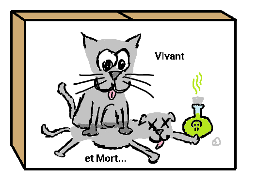

# 🕰️ Mesure Quantique et Effet Zénon Quantique

Ce dépôt contient le rapport de mon stage de fin de Licence sur l'**Effet Zénon Quantique**. Ce stage a été réalisé au **Laboratoire de Physique Théorique et Modélisation (LPTM)** de l'Université CY Cergy Paris, sous la supervision de **M. Lorenzo Fratino**.  

L'étude explore les fondements de la mesure quantique et met en évidence les aspects théoriques et pratiques de l'effet Zénon, un phénomène ayant des applications majeures en informatique quantique.

Dans ce rapport, j'ai voulu redéfinir les bases de la mécanique quantique à l'aide d'exemples et d'images que j'ai créés moi-même afin de rendre le tout plus intuitif. La mesure en mécanique quantique me fascine, c'était donc le moment pour moi de me faire plaisir sur ce sujet.  

J'ai adoré mettre sur papier, comme ce fameux chat de Schrodinger, tous ces concepts qui me fascinent afin de les partager.

Ce répertoire est en français, tout comme mon rapport. J'avais prévu de traduire l'intégralité en anglais, mais j'ai finalement décidé de le laisser tel quel, car il s'agit de mes premiers pas dans le monde de la recherche.

## Rapports

- **Titre** : Étude de la Mesure Quantique, Application à l'Effet Zénon  
- **Fichier** : [rapport-stage_Zenon-effect_HUET-Theo_2024.pdf](rapport-stage_Zenon-effect_HUET-Theo_2024.pdf)  
- **Résumé** : Ce rapport traite des bases théoriques de la mesure quantique, en se concentrant sur les postulats de la mécanique quantique. Il examine l'effet Zénon à travers une analyse théorique, une modélisation mathématique et des résultats expérimentaux, en mettant en avant son utilité pour la stabilisation des états quantiques en informatique quantique.

## Sujets abordés
- Postulats de la mécanique quantique et leurs implications sur la mesure.
- Démonstration théorique de l'effet Zénon quantique.
  - Sur un Hamiltonien independant du temps
  - Sur l'Hamiltonien d'un ion piégé qui subit une oscilation de Rabi
- Proposition de Cook et rôle de la matrice densité.
- Représentation des états quantiques sur la sphère de Bloch.
- Observations expérimentales de l'effet Zénon quantique.
- Comparaison entre la théorie et l'experience

## À propos du stage
- **Durée** : 29 avril 2024 – 29 mai 2024  
- **Institution** : Université CY Cergy Paris  
- **Laboratoire** : Laboratoire de Physique Théorique et Modélisation (LPTM) et CNRS  
- **Encadrant** : [Lorenzo Fratino](https://www.cyu.fr/lorenzo-fratino)  

## Structure du dépôt
- `rapport-stage_Zenon-effect_HUET-Theo_2024.pdf` : Rapport complet en français.
- `/tex/` : dossier contenant tout ce qu'il faut pour generer mon rapport en Latex.
  - `/tex/rapport-Zenon-effect-French.tex` : Rapport en Latex (il sagit de mon premier document .tex !)
  - `/tex/images/` : Diagrammes et illustrations utilisés dans les rapports.

## Remerciements
Un grand merci à mon encadrant, **M. Lorenzo Fratino**, pour son accompagnement précieux, ainsi qu'à l'équipe du LPTM pour avoir offert un environnement de recherche stimulant.

## Contact
Si vous avez des questions ou des suggestions, n'hésitez pas à me contacter :
- **Email** : theo6huet@gmail.com  
- **LinkedIn** : [theo-huet](https://www.linkedin.com/in/theo-huet/)
